# prophet-challenge
# Mercado Libre Search Trends, Stock Prices 
### Step 1: Find unusual patterns in hourly Google search traffic.
This section was to addres the question "Did the Google search traffic increase during the month that MercadoLibre released its financial results?"

Read the search data into a DataFrame, and then slice the data to just the month of May 2020. 
File was read from "https://static.bc-edx.com/ai/ail-v-1-0/m8/lms/datasets/google_hourly_search_trends.csv"   
May 2020 Search Trends plot -  
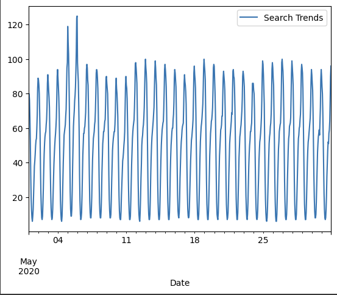  

Calculate the total search traffic for the month, and then compare the value to the monthly median across all months.  
It was found that in the monthe of May Google search traffic increase by about 8.55%.  
Note that in the month of May MercadoLibre released its financial results? 

### Step 2: Mine the search traffic data for seasonality.
Group the hourly search data to plot the average traffic by the hour of the day  
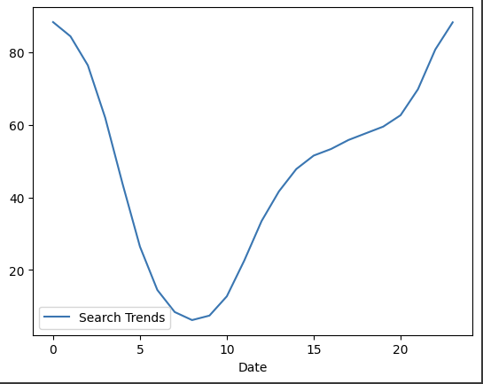  
Hourly search trends graph shows that trend is the least in early hours of morning and starts to rise gradually from around 10 AM and peaking around midnight.  

Group the hourly search data to plot the average traffic by the day of the week  
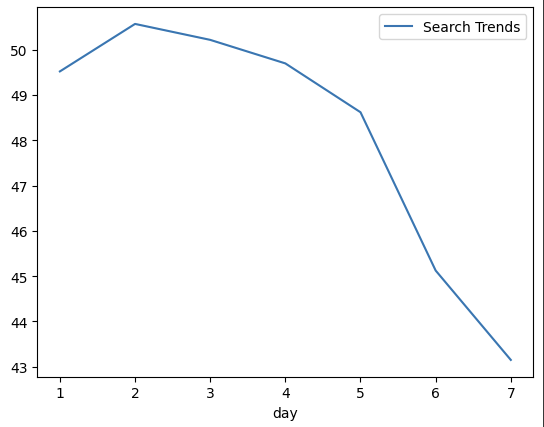  
Daily search trends graph shows that the trend starts high from Monday and Tuesday and gradually dropping to low towards the end of week. 

Group the hourly search data to plot the average traffic by the week of the year  
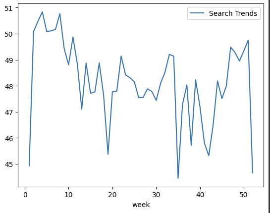  
Weekly search trends show a huge jump from close to lowest point to max point in the early weeks (2 to 5) of the year. Then there is downward trend going down close to lowest point around week 19. From weeks 21 - 33 trends seems to be sideways. Trend is volatile between weeks 33 - 43 with spikes in the pattern. Then from weeks 43 to 51 trend is in upward trajectory before dropiing to second lowest level around week 52 and week 1.  

### Step 3: Relate the search traffic to stock price patterns.
Read in and plot the stock price data. File location is "https://static.bc-edx.com/ai/ail-v-1-0/m8/lms/datasets/mercado_stock_price.csv".  
Concatenate the stock price data to the search data in a single DataFrame.
Slice the data to just the first half of 2020 (2020-01 to 2020-06 in the DataFrame), and then plot the data.  
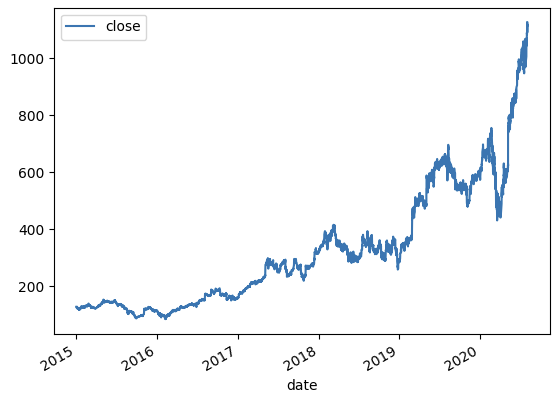  

Create a new column in the DataFrame named “Lagged Search Trends” that offsets, or shifts, the search traffic by one hour. Create two additional columns:

    - “Stock Volatility”, which holds an exponentially weighted four-hour rolling average of the company’s stock volatility

    - “Hourly Stock Return”, which holds the percent change of the company's stock price on an hourly basis

    - Review the time series correlation, and then answer the following question: Does a predictable relationship exist between the lagged search traffic and the stock volatility or between the lagged search traffic and the stock price returns?  

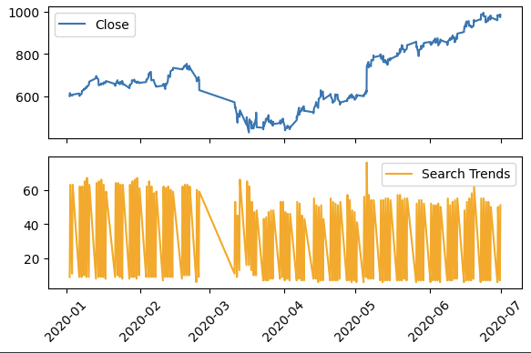  
There does not appear to be a common trend between both of above graphs. from middle of May onwards stock close seem to be trending higher where as search trend is mostly neutral.  

Stock Volotality Plot:  
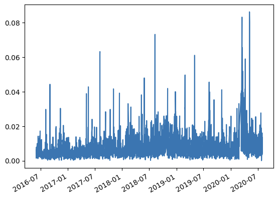  

Correlation table of Stock Volatility, Lagged Search Trends, and Hourly Stock Return  
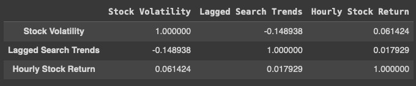  
Correlation value between 'Lagged Search Trends' and the 'Stock Volatility' is -0.148938. This indicates a weak relationship between 'Lagged Search Trends' and the 'Stock Volatility'.

Correlation value between 'Lagged Search Trends' and the 'Hourly Stock Return' is 0.017929
Again this indicates a weak relationship between 'Lagged Search Trends' and the 'Hourly Stock Return'. Relationship is almost negligible.

In conclusion 'Lagged Search Trends' does not have any impact on 'Stock Volatility' or 'Hourly Stock Return'.  

### Step 4: Create a time series model with Prophet.
Following steps were performed - 
1. Set up the Google search data for a Prophet forecasting model.
2. After estimating the model, plot the forecast. How's the near-term forecast for the popularity of MercadoLibre?
3. Plot the individual time series components of the model to answer the following questions:
    What time of day exhibits the greatest popularity?
    Which day of the week gets the most search traffic?
    What's the lowest point for search traffic in the calendar year?  

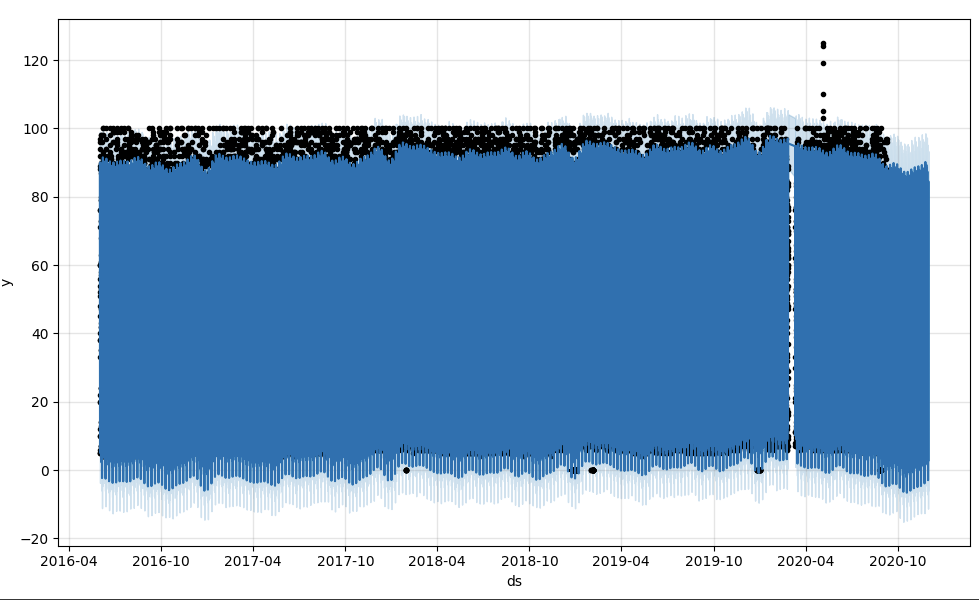  
Forecast values (blue line) appear to remain relatively stable and consistent with the past trend. There is no significant upward or downward trend.
Light blue shaded lines are narrow and indicate reasonably high confidence in prediction.
Based on the plot near-term forecast suggests a stable trend without any significatnt increase or decrease.  

Plot the data to visualize the yhat, yhat_lower, and yhat_upper columns over the last 2000 hours:  
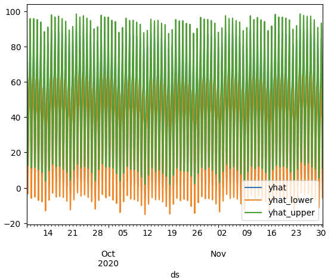  

Plot components:  
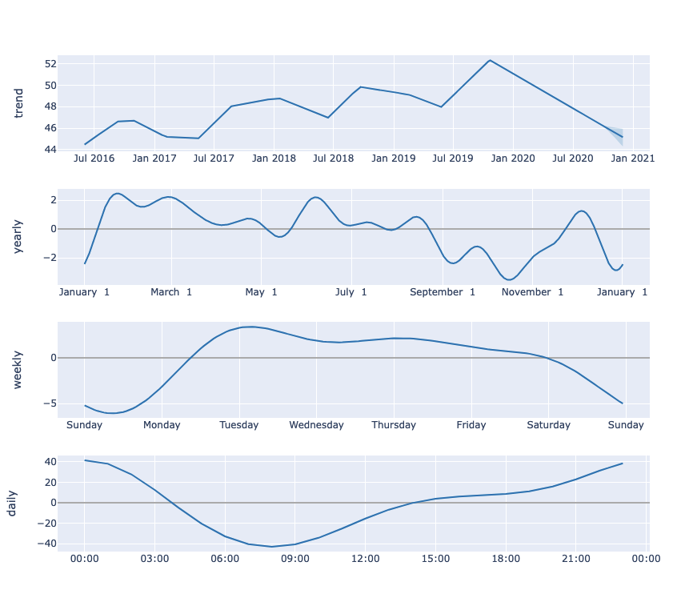  

Question: What time of day exhibits the greatest popularity?
Answer: Around midnight (between 11pm-12am) it shows to be having a greatest popularity.

Question: Which day of week gets the most search traffic?
Answer: Tuesday seems to be getting the most search traffic.

Question: What's the lowest point for search traffic in the calendar year?
Answer: Mid-october (October 15th) seems to be the lowest point for search traffic in the calendar year.

